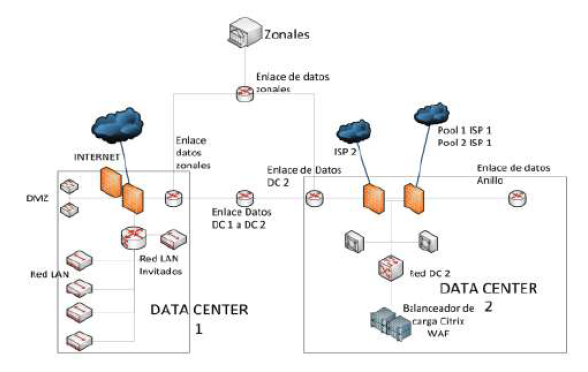

# Sistema independiente para la seguridad de la información
### Daniel Felipe Camargo Roa - 20172020078

#### Desarrollo:

Este trabajo presenta la implementación de un sistema independiente para la seguridad de la información, manteniendo la integridad, confidencialidad y disponibilidad de la información, protegiendo los sistemas de amenazas internas y externas. La importancia que posee la seguridad de la información, actualmente donde la tendencia a nivel mundial en cuanto a amenazas sigue creciendo y la información se expone a cualquier entidad que tenga los recursos suficientes para acceder a ella, en este contexto; se propuso realizar una renovación tecnológica con equipos virtualizados que permitan ampliar la capacidad cuando sea necesario y mantener su efectividad en el control de amenazas. Adicional, que trabajen en HA(High Availability) en los dos centros de datos, presentando una topología con cuatro equipos. Los equipos implementados aplican políticas en tiempo real, trabajan con módulos de filtrado URL, IPS, antimalware, antivirus, sandboxing y control de aplicaciones, obteniendo como resultado una protección efectiva a toda la plataforma tecnológica de la institución.

#### Metodología:

Para la implementación y configuración del sistema de seguridad independiente se utilizó el método práctico, así como también en la fase de pruebas, ya que se realizó una renovación total de los equipos firewall. La fase donde se realizaron pruebas se apoyó en el método experimental ya que se pueden medir errores y comprobaciones previas para el correcto funcionamiento del sistema implementado. En esta fase se hace un reconocimiento de los equipos físicos y lógicos existentes, un levantamiento de software y se acuerdan los mecanismos para la comunicación entre ambos. A continuación, se realiza la conexión de todos los equipos, configuración y depuración de reglas. Se presenta un diseño de topología de seguridad de red perimetral y se finaliza con las pruebas de funcionamiento y validación de accesos hacia las diferentes zonas de la infraestructura tecnológica.

### Diseño:

Se propone la creación de un sistema independiente para la seguridad de la información basado en servidores virtuales que reemplacen a los equipos físicos appliance, la Figura 1 detalla el esquema de seguridad propuesto. La idea es que el software para firewall seleccionado sea instalado en los servidores virtuales para así tener abierta la posibilidad de aumentar o disminuir recursos cuando sea necesario, para que el sistema siempre esté funcionando al 100%. Esto ya que constantemente está creciendo el tráfico anual que atraviesan los equipos de seguridad perimetral. Los equipos estarán instalados en HA, dos servidores en el Data Center 1, dos servidores en el Data Center 2. Además, en el Data Center 1 estará instalado un servidor que servirá como administrador para los cuatro equipos, y este mismo generará reportes con un espacio suficiente para almacenar logs que se sincronicen con todos los equipos.

# Seguridad-de-la-informacion
